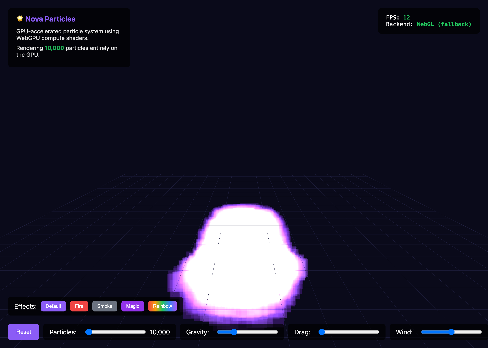

# ✨ Nova Particles



> **Next-Generation GPU Particle System**
> 
> Simulate millions of particles at 60fps in your browser using WebGPU compute shaders.

Nova Particles is a high-performance particle engine built with **Three.js** and **WebGPU**. By leveraging compute shaders (via TSL - Three.js Shading Language), it offloads all physics calculations to the GPU, enabling massive simulations that were previously impossible in the browser.

## 🚀 Features

- **Massive Scale**: Render 1M+ particles effortlessly at 60fps.
- **GPU-First Architecture**: Physics, collision, and behavior all run on the GPU.
- **WebGPU Powered**: Utilizes modern compute shaders for maximum parallelism.
- **Flexible Emitters**: Support for Point, Sphere, Box, Cone, and Circle shapes.
- **Advanced Behaviors**: Gravity, Drag, Wind, Vortex, and Noise forces.
- **Rich Visuals**: Trail rendering, additive blending, and dynamic color gradients.
- **Cross-Platform**: Built for WebGPU with graceful fallbacks (where applicable).

## 📦 Tech Stack

- **Core**: [Three.js](https://threejs.org/) (WebGPU Renderer)
- **Language**: TypeScript
- **Build Tool**: Vite (for the web app)
- **Package Manager**: pnpm

## 🛠️ Getting Started

### Prerequisites

- **Node.js**: v18+
- **pnpm**: v8+
- **Browser**: Chrome 113+, Edge 113+, or Safari 18+ (WebGPU support required)

### Installation

1. **Clone the repository:**
   ```bash
   git clone https://github.com/your-username/nova-particles.git
   cd nova-particles
   ```

2. **Install dependencies:**
   ```bash
   pnpm install
   ```

3. **Run the development server:**
   ```bash
   pnpm dev
   ```

4. **Open in browser:**
   Navigate to `http://localhost:5173` to see the demo.

## 🎮 Usage Controls

- **Left Click + Drag**: Rotate camera
- **Right Click + Drag**: Pan camera
- **Scroll**: Zoom in/out
- **UI Controls**:
  - Adjust particle count (up to 1M)
  - Tweak physics (gravity, drag, wind)
  - Toggle trails
  - Select presets (Fire, Smoke, Magic, Rainbow)

## 🧩 Architecture

Nova Particles uses a **Structure of Arrays (SoA)** approach in GPU storage buffers to maximize cache efficiency.

1.  **Storage Buffers**: Store position, velocity, life, color, and size data.
2.  **Compute Shaders**: Update particle state every frame based on physics and behaviors.
3.  **Vertex Fetch**: The renderer reads directly from these buffers to draw instances, avoiding CPU-GPU data transfer.

## 📄 License

MIT © Nova Particles Team
