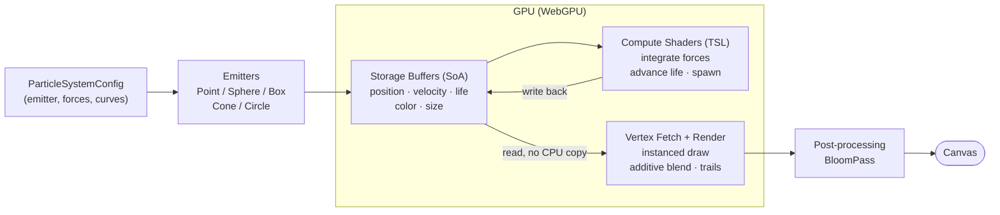
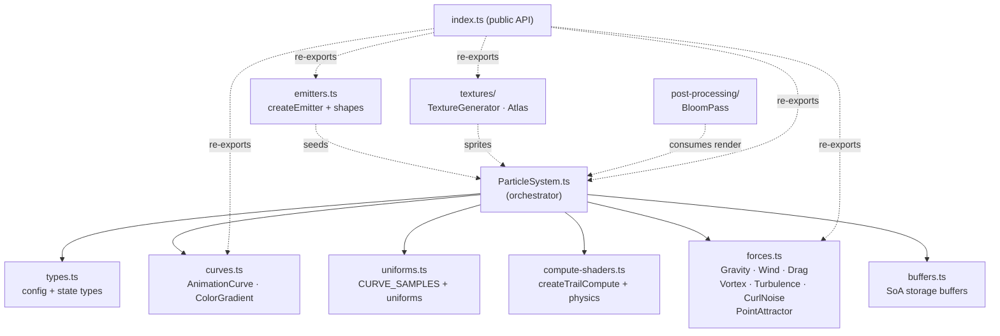

# Architecture

> Snapshot as of 2026-07-28. Diagrams describe `@nova-particles/core` and the web demo.

Nova Particles keeps particle state in GPU storage buffers (Structure of Arrays) and
updates it with WebGPU compute shaders (TSL). The renderer reads those same buffers
directly, so per-frame simulation never round-trips through the CPU.

## GPU simulation pipeline

The per-frame data flow, from configuration to pixels:

Key point: `Compute` reads and writes `Buffers`, and `Render` reads the same `Buffers`.
No CPU-to-GPU transfer per frame — that is what allows 1M+ particles at 60fps.

## Core module map

How `@nova-particles/core` modules relate (`ParticleSystem` is the hub):

Solid arrows = direct import/use by `ParticleSystem`. Dashed = sibling modules wired in
by the consumer (the web demo) or re-exported through `index.ts`.
